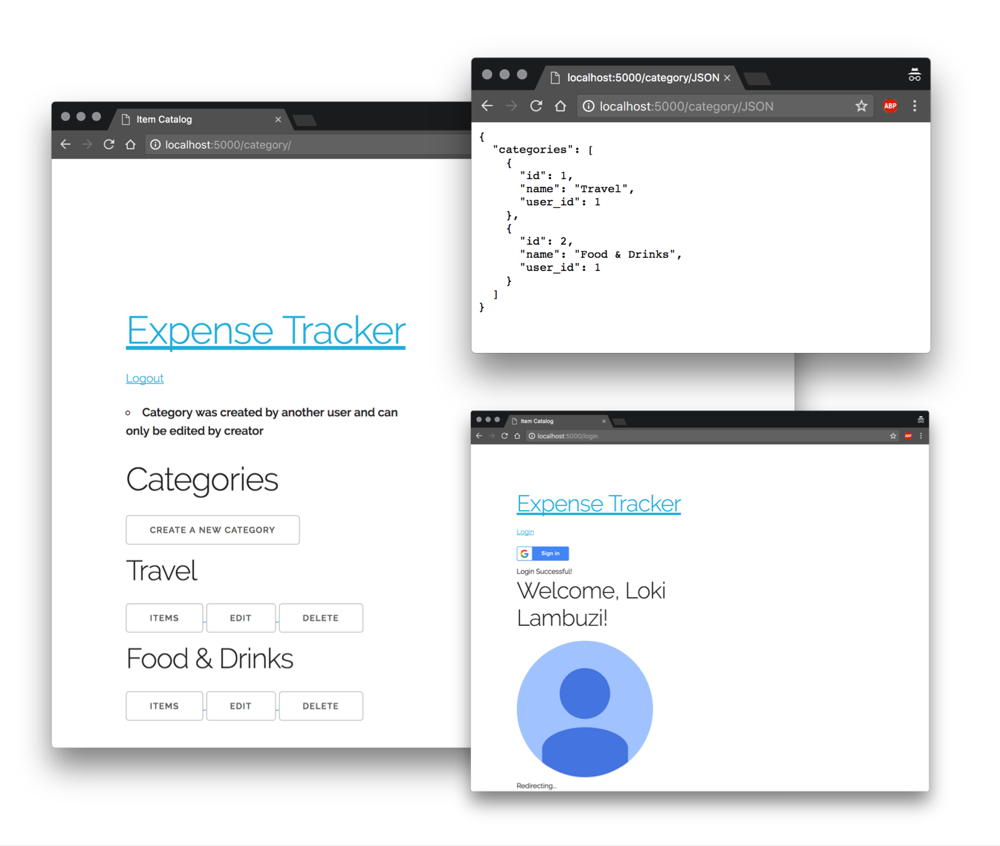

# Item Catalog

This is the fourth side project of the Software Development

The objective of the Item Catalog is to build a website with Flask, SQLAlchemy, third party OAuths and API endpoints.



## How do I run this?

### 1. Setup: Configure VM & Database

**Step 1:** Download and install [Vagrant](https://www.vagrantup.com/) and [VirtualBox](https://www.virtualbox.org). We’ll need these tools to setup and manage the Virtual Machine (VM). 

I used version 1.9.2 of Vagrant and version 5.1 of VirtualBox (mentioned because I faced issues on newer and older versions). 

**Step 2:** Once you've cloned this project, open the terminal and then run the following commands:

```
# Install & Configure VM
cd /path/to/vagrant
vagrant up

# Log into machine
vagrant ssh

# Log out of machine
# <Ctrl + D>

# Destroy machine once done
vagrant destroy

```

Note: If this is the first time you're running [Vagrant Up](https://www.vagrantup.com/docs/cli/up.html) command, you need to wait a while after running the command. 


### 2. Run the website

Open the terminal. Then, run the following commands:

```
# Launch & Login to machine
cd /path/to/vagrant
vagrant up
vagrant ssh

# Open shared folder
cd /vagrant/catalog 

# Run the program
python catalog.py
```


